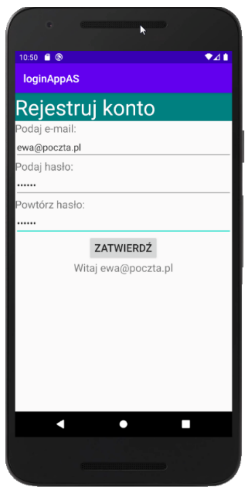

# LinearLayout

**Technik programista | klasa 5 | aplikacje mobilne**

Orientacja, wagi, `gravity` kontra `layout_gravity`, zagnieżdżanie układów.

---

## 1. Po co drugi layout, skoro jest ConstraintLayout

ConstraintLayout radzi sobie ze wszystkim, ale za wszystko każe płacić tą samą cenę:
**każdy element potrzebuje co najmniej dwóch powiązań**. Kiedy budujesz formularz,
w którym dziesięć elementów stoi po prostu jeden pod drugim, wpisujesz trzydzieści
atrybutów opisujących coś, co da się powiedzieć jednym słowem: *pionowo*.

Do tego służy LinearLayout. Układa dzieci **w jednej linii** – pionowo albo poziomo –
w kolejności, w jakiej występują w pliku. Żadnych powiązań, żadnych identyfikatorów
potrzebnych do pozycjonowania.

```
   pionowo (vertical)          poziomo (horizontal)
   ┌───────────────┐           ┌───────────────────┐
   │ [    A      ] │           │ [A] [B] [  C    ] │
   │ [    B      ] │           │                   │
   │ [    C      ] │           │                   │
   └───────────────┘           └───────────────────┘
```

Kiedy co wybrać:

| Sytuacja | Układ |
|---|---|
| Formularz: etykieta, pole, etykieta, pole, przycisk | **LinearLayout** pionowy |
| Rząd przycisków dzielących szerokość po równo | **LinearLayout** poziomy z wagami |
| Element przyklejony do rogu, nad czymś, obok czegoś | **ConstraintLayout** |
| Ekran, w którym elementy mają się do siebie odnosić | **ConstraintLayout** |
| Siatka przycisków kalkulatora | **LinearLayout** zagnieżdżony |

W praktyce miesza się oba: ConstraintLayout jako kontener główny, a w środku
LinearLayout tam, gdzie coś ma stać po prostu w rzędzie. Na tej lekcji budujemy
ekrany w całości na LinearLayout, żeby poznać jego mechanikę.

---

## 2. Szkielet i pierwszy przykład

Szablon *Empty Views Activity* generuje ConstraintLayout. Żeby pracować
na LinearLayout, **wymieniasz element korzeniowy** – otwierający i zamykający znacznik.

> **`android:id="@+id/main"` zostaje.** Wygenerowana `MainActivity` zawiera wywołanie
> `findViewById(R.id.main)` w linii ustawiającej marginesy systemowe. Po zmianie
> albo usunięciu tego identyfikatora aplikacja zgaśnie przy starcie
> z `NullPointerException` – ten sam błąd omawialiśmy przy pierwszym projekcie.

Kompletny plik do wklejenia w `activity_main.xml`:

```xml
<?xml version="1.0" encoding="utf-8"?>
<LinearLayout xmlns:android="http://schemas.android.com/apk/res/android"
    xmlns:tools="http://schemas.android.com/tools"
    android:id="@+id/main"
    android:layout_width="match_parent"
    android:layout_height="match_parent"
    android:orientation="vertical"
    android:padding="16dp"
    tools:context=".MainActivity">

    <Button
        android:id="@+id/btnOne"
        android:layout_width="match_parent"
        android:layout_height="wrap_content"
        android:text="Pierwszy" />

    <Button
        android:id="@+id/btnTwo"
        android:layout_width="match_parent"
        android:layout_height="wrap_content"
        android:text="Drugi" />

    <Button
        android:id="@+id/btnThree"
        android:layout_width="match_parent"
        android:layout_height="wrap_content"
        android:text="Trzeci" />

</LinearLayout>
```

Trzy przyciski, jeden pod drugim, każdy na całą szerokość. Bez jednego powiązania.

Zwróć uwagę, czego **nie ma** w nagłówku: deklaracji `xmlns:app`. Jest ona potrzebna
dopiero wtedy, gdy użyjesz atrybutu z przedrostkiem `app:` – w czystym LinearLayout
takich atrybutów nie ma. Jeśli dopiszesz komponent Material korzystający z `app:`,
deklarację trzeba przywrócić.

> **Najczęstszy błąd pierwszej minuty: brak `android:orientation`.**
> Wartością domyślną jest **`horizontal`**, nie pionowa. Layout bez tego atrybutu
> ustawi wszystko w jednym rzędzie, a elementy, które się nie zmieszczą, po prostu
> zostaną ucięte poza ekranem. Android Studio ostrzega o tym żółtym podkreśleniem.
> **Zawsze wpisuj orientację jawnie**, nawet gdy chcesz poziomą.

---

## 3. Rozmiary elementów

W LinearLayout obowiązują trzy wartości, tak jak wszędzie, ale ich znaczenie
zależy od tego, czy mówimy o osi zgodnej z orientacją, czy prostopadłej.

| Wartość | W osi orientacji | W osi prostopadłej |
|---|---|---|
| `wrap_content` | tyle, ile zajmuje zawartość | tyle, ile zajmuje zawartość |
| `match_parent` | **zabiera całą przestrzeń** – kolejne elementy znikają | rozciąga na całą szerokość/wysokość |
| konkretne `dp` | dokładnie tyle | dokładnie tyle |
| `0dp` + `layout_weight` | udział w podziale przestrzeni | nie ma sensu |

Środkowy wiersz to pułapka, na którą nadzieje się każdy:

> **W pionowym LinearLayout pierwszy element z `layout_height="match_parent"`
> zabiera cały ekran, a wszystko poniżej przestaje być widoczne.**
> Aplikacja się buduje, nie ma żadnego błędu – po prostu widać jeden element zamiast
> pięciu. W osi zgodnej z orientacją używasz `wrap_content` albo wagi, nigdy
> `match_parent`.

W osi prostopadłej `match_parent` jest natomiast normalny i pożądany – w pionowym
układzie `layout_width="match_parent"` oznacza po prostu „na całą szerokość".

---

## 4. `layout_weight` – podział przestrzeni

To jest mechanizm, dla którego LinearLayout w ogóle warto znać.

Waga mówi, **jaki udział w wolnej przestrzeni** ma dostać element. Trzy przyciski
z wagą `1` podzielą szerokość na trzy równe części. Przyciski z wagami `1`, `2`, `1`
podzielą ją w proporcji 25% – 50% – 25%.

Warunek jest jeden i bezwzględny:

> **Wymiar w osi podziału musi wynosić `0dp`.**
> W układzie poziomym: `android:layout_width="0dp"`.
> W układzie pionowym: `android:layout_height="0dp"`.

Kompletny plik – trzy przyciski w proporcji 1 : 2 : 1:

```xml
<?xml version="1.0" encoding="utf-8"?>
<LinearLayout xmlns:android="http://schemas.android.com/apk/res/android"
    xmlns:tools="http://schemas.android.com/tools"
    android:id="@+id/main"
    android:layout_width="match_parent"
    android:layout_height="match_parent"
    android:orientation="horizontal"
    android:padding="16dp"
    tools:context=".MainActivity">

    <Button
        android:id="@+id/btnBack"
        android:layout_width="0dp"
        android:layout_height="wrap_content"
        android:layout_weight="1"
        android:text="Wstecz" />

    <Button
        android:id="@+id/btnSave"
        android:layout_width="0dp"
        android:layout_height="wrap_content"
        android:layout_weight="2"
        android:text="Zapisz" />

    <Button
        android:id="@+id/btnNext"
        android:layout_width="0dp"
        android:layout_height="wrap_content"
        android:layout_weight="1"
        android:text="Dalej" />

</LinearLayout>
```

Suma wag to 1 + 2 + 1 = 4, więc środkowy przycisk dostaje połowę szerokości,
a skrajne po jednej czwartej.

**Spróbuj:** zmień w `btnSave` szerokość z `0dp` na `wrap_content`, zostawiając wagę.
Przycisk najpierw weźmie tyle, ile potrzebuje na napis, i **dopiero resztę** podzieli
według wag – układ się rozjedzie. To jest dokładna odpowiedź na pytanie
„dlaczego moje wagi nie działają".

### Dlaczego akurat `0dp`

Android liczy szerokości w dwóch krokach: najpierw przydziela każdemu elementowi tyle,
ile wynika z jego `layout_width`, a **wolną resztę** dzieli według wag. Przy
`wrap_content` każdy element najpierw zabiera swoje, a proporcje dotyczą tylko tego,
co zostało – i przyciski o dłuższych napisach wychodzą szersze. Przy `0dp` nikt nie
zabiera nic na starcie, więc do podziału idzie cała przestrzeń i proporcje wychodzą
dokładnie takie, jakie wpisałeś.

### `weightSum` – rezerwowanie miejsca

Atrybut rodzica `android:weightSum` ustawia sumę wag z góry. Jeśli faktyczne wagi
dzieci są mniejsze, reszta zostaje pusta.

```xml
<LinearLayout
    android:orientation="horizontal"
    android:weightSum="4"
    ... >

    <!-- ten przycisk zajmie 3/4 szerokości, 1/4 zostanie wolna -->
    <Button
        android:layout_width="0dp"
        android:layout_height="wrap_content"
        android:layout_weight="3"
        android:text="Trzy czwarte" />
</LinearLayout>
```

---

## 5. `gravity` kontra `layout_gravity`

Dwa atrybuty o podobnych nazwach i zupełnie różnym działaniu. Mylenie ich to
najczęstsza przyczyna pytań „dlaczego to się nie centruje".

| Atrybut | Kto go ma | Co ustawia |
|---|---|---|
| `android:gravity` | dowolny element | położenie **zawartości wewnątrz** tego elementu |
| `android:layout_gravity` | dziecko kontenera | położenie **tego elementu wewnątrz rodzica** |

Reguła do zapamiętania: **przedrostek `layout_` zawsze oznacza „rozmawiam z rodzicem"**.
Bez przedrostka – „rozmawiam ze swoim wnętrzem".

```xml
<!-- tekst wyśrodkowany WEWNĄTRZ etykiety, która zajmuje całą szerokość -->
<TextView
    android:layout_width="match_parent"
    android:layout_height="60dp"
    android:gravity="center"
    android:text="Na środku etykiety" />

<!-- przycisk wyśrodkowany WEWNĄTRZ pionowego LinearLayout -->
<Button
    android:layout_width="wrap_content"
    android:layout_height="wrap_content"
    android:layout_gravity="center_horizontal"
    android:text="Na środku ekranu" />
```

Kompletny plik pokazujący obie różnice naraz:

```xml
<?xml version="1.0" encoding="utf-8"?>
<LinearLayout xmlns:android="http://schemas.android.com/apk/res/android"
    xmlns:tools="http://schemas.android.com/tools"
    android:id="@+id/main"
    android:layout_width="match_parent"
    android:layout_height="match_parent"
    android:orientation="vertical"
    android:padding="16dp"
    tools:context=".MainActivity">

    <TextView
        android:id="@+id/tvStart"
        android:layout_width="match_parent"
        android:layout_height="60dp"
        android:background="#E0E0E0"
        android:gravity="start|center_vertical"
        android:text="gravity = start" />

    <TextView
        android:id="@+id/tvCenter"
        android:layout_width="match_parent"
        android:layout_height="60dp"
        android:layout_marginTop="8dp"
        android:background="#E0E0E0"
        android:gravity="center"
        android:text="gravity = center" />

    <TextView
        android:id="@+id/tvEnd"
        android:layout_width="match_parent"
        android:layout_height="60dp"
        android:layout_marginTop="8dp"
        android:background="#E0E0E0"
        android:gravity="end|bottom"
        android:text="gravity = end|bottom" />

    <Button
        android:id="@+id/btnLeft"
        android:layout_width="wrap_content"
        android:layout_height="wrap_content"
        android:layout_marginTop="24dp"
        android:text="layout_gravity: brak" />

    <Button
        android:id="@+id/btnCenter"
        android:layout_width="wrap_content"
        android:layout_height="wrap_content"
        android:layout_gravity="center_horizontal"
        android:text="layout_gravity: center" />

    <Button
        android:id="@+id/btnRight"
        android:layout_width="wrap_content"
        android:layout_height="wrap_content"
        android:layout_gravity="end"
        android:text="layout_gravity: end" />

</LinearLayout>
```

Trzy pierwsze elementy mają identyczny rozmiar i różnią się wyłącznie położeniem
napisu w środku. Trzy przyciski mają identyczną treść i różnią się położeniem
w kontenerze.

> **`layout_gravity` nie działa w osi zgodnej z orientacją.**
> W pionowym LinearLayout `layout_gravity="center_vertical"` nie zrobi nic – o pozycji
> pionową decyduje kolejność elementów. Zadziała `center_horizontal`, bo to oś
> prostopadła. W poziomym układzie jest odwrotnie. Żeby wyśrodkować **wszystkie**
> dzieci w osi orientacji, użyj `android:gravity="center"` **na kontenerze**.

---

## 6. Odstępy i separatory

Margines i padding działają tak samo jak w ConstraintLayout – z jedną różnicą:
tutaj margines **zawsze** ma efekt, bo nie zależy od istnienia powiązania.

```xml
android:layout_marginTop="8dp"        <!-- odstęp od poprzedniego elementu -->
android:layout_margin="8dp"           <!-- ze wszystkich stron -->
android:padding="12dp"                <!-- wewnątrz elementu -->
android:paddingHorizontal="16dp"      <!-- lewo i prawo -->
```

LinearLayout ma też wbudowane separatory między dziećmi:

```xml
<LinearLayout
    android:orientation="vertical"
    android:divider="@android:drawable/divider_horizontal_bright"
    android:showDividers="middle"
    android:dividerPadding="8dp"
    ... >
```

`showDividers` przyjmuje `none`, `beginning`, `middle`, `end` – wartości można
łączyć znakiem `|`. Przy prostych ekranach szybciej jest wstawić cienki `View`:

```xml
<View
    android:layout_width="match_parent"
    android:layout_height="1dp"
    android:layout_marginVertical="8dp"
    android:background="#CCCCCC" />
```

---

## 7. Zagnieżdżanie

Jeden LinearLayout układa elementy w jednej linii. Żeby zbudować cokolwiek
dwuwymiarowego, wkładasz **poziome układy do pionowego**:

```
pionowy LinearLayout
├── TextView (nagłówek)
├── poziomy LinearLayout
│   ├── Button  ├── Button  └── Button
├── poziomy LinearLayout
│   ├── Button  ├── Button  └── Button
└── Button (stopka)
```

Kompletny plik – nagłówek, dwa rzędy po trzy przyciski, stopka:

```xml
<?xml version="1.0" encoding="utf-8"?>
<LinearLayout xmlns:android="http://schemas.android.com/apk/res/android"
    xmlns:tools="http://schemas.android.com/tools"
    android:id="@+id/main"
    android:layout_width="match_parent"
    android:layout_height="match_parent"
    android:orientation="vertical"
    android:padding="16dp"
    tools:context=".MainActivity">

    <TextView
        android:id="@+id/tvTitle"
        android:layout_width="match_parent"
        android:layout_height="wrap_content"
        android:background="#008080"
        android:gravity="center"
        android:padding="12dp"
        android:text="Panel sterowania"
        android:textColor="#FFFFFF"
        android:textSize="24sp" />

    <LinearLayout
        android:id="@+id/rowTop"
        android:layout_width="match_parent"
        android:layout_height="wrap_content"
        android:layout_marginTop="16dp"
        android:orientation="horizontal">

        <Button
            android:id="@+id/btnA"
            android:layout_width="0dp"
            android:layout_height="wrap_content"
            android:layout_weight="1"
            android:text="A" />

        <Button
            android:id="@+id/btnB"
            android:layout_width="0dp"
            android:layout_height="wrap_content"
            android:layout_weight="1"
            android:text="B" />

        <Button
            android:id="@+id/btnC"
            android:layout_width="0dp"
            android:layout_height="wrap_content"
            android:layout_weight="1"
            android:text="C" />
    </LinearLayout>

    <LinearLayout
        android:id="@+id/rowBottom"
        android:layout_width="match_parent"
        android:layout_height="wrap_content"
        android:layout_marginTop="8dp"
        android:orientation="horizontal">

        <Button
            android:id="@+id/btnD"
            android:layout_width="0dp"
            android:layout_height="wrap_content"
            android:layout_weight="1"
            android:text="D" />

        <Button
            android:id="@+id/btnE"
            android:layout_width="0dp"
            android:layout_height="wrap_content"
            android:layout_weight="1"
            android:text="E" />

        <Button
            android:id="@+id/btnF"
            android:layout_width="0dp"
            android:layout_height="wrap_content"
            android:layout_weight="1"
            android:text="F" />
    </LinearLayout>

    <Button
        android:id="@+id/btnConfirm"
        android:layout_width="wrap_content"
        android:layout_height="wrap_content"
        android:layout_gravity="center_horizontal"
        android:layout_marginTop="24dp"
        android:text="Zatwierdź" />

</LinearLayout>
```

Zauważ, że **zagnieżdżony układ też ma swoje `layout_width` i `layout_height`** –
jest dzieckiem tak samo jak przycisk. I ma własną orientację, którą trzeba wpisać.

### Ile można zagnieżdżać

Technicznie bez ograniczeń, praktycznie **do trzech poziomów**. Każdy poziom to
dodatkowa praca przy rysowaniu ekranu, a LinearLayout z wagami mierzy swoje dzieci
**dwukrotnie** – raz żeby poznać ich rozmiary, drugi raz po podziale przestrzeni.
Zagnieżdżone układy z wagami mnożą tę pracę przez siebie.

Jeśli łapiesz się na czwartym poziomie zagnieżdżenia, to jest sygnał, że ten ekran
powinien być zbudowany w ConstraintLayout, który ma płaską hierarchię i mierzy
wszystko raz.

---

## 8. Wyrównanie do linii tekstu

W poziomym układzie elementy o różnej wysokości domyślnie wyrównują się
do **linii bazowej tekstu**, nie do górnej krawędzi. Dlatego etykieta 14sp i pole
20sp stojące obok siebie wyglądają dobrze bez żadnych dodatkowych atrybutów.

Kiedy to przeszkadza – na przykład gdy w rzędzie stoi obrazek i tekst – wyłączasz je
na kontenerze:

```xml
android:baselineAligned="false"
```

Android Studio sam podpowiada ten atrybut, gdy w poziomym układzie z wagami wykryje
mieszankę elementów tekstowych i nietekstowych.

---

## 9. Częste błędy

| Objaw | Przyczyna | Rozwiązanie |
|---|---|---|
| Wszystko w jednym rzędzie, część poza ekranem | brak `android:orientation` – domyślnie `horizontal` | dopisz `android:orientation="vertical"` |
| Widać tylko pierwszy element | pierwszy ma `match_parent` w osi orientacji | zmień na `wrap_content` lub wagę |
| Wagi nie dzielą po równo | wymiar w osi podziału to `wrap_content`, nie `0dp` | ustaw `0dp` w osi orientacji |
| `layout_gravity="center_vertical"` nic nie robi | to oś zgodna z orientacją kontenera | użyj `gravity="center"` na kontenerze |
| Tekst przyklejony do lewej mimo `layout_gravity` | pomylone z `gravity` | zawartość ustawia `gravity`, element – `layout_gravity` |
| Zagnieżdżony układ zajmuje cały ekran | ma `layout_height="match_parent"` | `wrap_content` albo waga |
| Ekran obcięty na dole, nie da się przewinąć | treść wyższa niż ekran | obejmij całość elementem `ScrollView` |
| Ostrzeżenie o zagnieżdżonych wagach | trzy poziomy układów z wagami | przebuduj ekran na ConstraintLayout |

> **`ScrollView` w jednym zdaniu:** może mieć **dokładnie jedno dziecko**, więc
> obejmuje się nim cały pionowy LinearLayout, a nie pojedyncze elementy.
> Wrócimy do tego przy listach.

---

## 10. Ściąga

**Kontener**

| Atrybut | Znaczenie |
|---|---|
| `android:orientation` | `vertical` albo `horizontal` – **zawsze wpisuj** |
| `android:gravity` | położenie wszystkich dzieci wewnątrz kontenera |
| `android:weightSum` | z góry ustalona suma wag |
| `android:baselineAligned` | `false` wyłącza wyrównanie do linii tekstu |
| `android:divider` + `showDividers` | separatory między dziećmi |

**Dziecko**

| Atrybut | Znaczenie |
|---|---|
| `android:layout_weight` | udział w podziale wolnej przestrzeni |
| `android:layout_gravity` | położenie tego elementu w kontenerze |
| `android:layout_margin*` | odstęp od sąsiadów |

**Rozmiary w osi orientacji**

| Zapis | Efekt |
|---|---|
| `wrap_content` | do zawartości |
| `0dp` + `layout_weight="1"` | udział w podziale |
| `match_parent` | **zabiera wszystko – nie używaj** |

**Podział po równo:** wszystkie dzieci `0dp` w osi orientacji + `layout_weight="1"`.
**Wyśrodkowanie jednego dziecka:** `layout_gravity="center_horizontal"` w układzie pionowym.
**Wyśrodkowanie wszystkich:** `android:gravity="center"` na kontenerze.

---

## 11. Zadania

Jak zawsze: osobne repozytorium, `README.md` ze zrzutem ekranu, commit po każdym kroku,
push na koniec zajęć. Wszystkie teksty widoczne dla użytkownika w `strings.xml`.

### Zadanie 1 – ekran rejestracji z egzaminu zawodowego

Zadanie pochodzi z arkusza egzaminacyjnego z 2021 roku. **Odtwórz wygląd ekranu
ze zrzutu** – wyłącznie w pliku `activity_main.xml`.



**Warunki:**

- Cały ekran zbudowany na **pionowym LinearLayout**. Bez ConstraintLayout.
- **Nie piszesz ani jednej linii w `MainActivity.java`.** Plik zostaje taki,
  jaki wygenerował szablon. Wszystkie widoczne napisy wpisujesz w XML-u.
- Nazwa aplikacji widoczna na pasku: `loginAppAS` (przez `strings.xml`, nie na sztywno
  w manifeście).

**Elementy, od góry:**

| Element | Wymagania |
|---|---|
| Nagłówek | tekst „Rejestruj konto", tło `#008080`, kolor tekstu biały, rozmiar ok. 36sp, szerokość całego ekranu |
| Etykieta | „Podaj e-mail:" |
| Pole e-mail | `inputType` właściwy dla adresu e-mail, wpisana wartość `ewa@poczta.pl` |
| Etykieta | „Podaj hasło:" |
| Pole hasła | `inputType` ukrywający znaki, wpisana dowolna wartość sześcioznakowa |
| Etykieta | „Powtórz hasło:" |
| Pole powtórzenia hasła | jak wyżej |
| Przycisk | tekst „ZATWIERDŹ", **wyśrodkowany w poziomie**, szerokość dopasowana do napisu |
| Etykieta wyniku | tekst „Witaj ewa@poczta.pl", **wyśrodkowana w poziomie** |

**Na co zwrócę uwagę przy sprawdzaniu:**

1. Nagłówek rozciąga się na całą szerokość ekranu, nie tylko na szerokość napisu.
2. Przycisk i etykieta powitania są wyśrodkowane, a pola i etykiety – nie.
   Sprawdź, czy użyłeś do tego właściwego z dwóch atrybutów.
3. Pola haseł pokazują kropki, a nie tekst.
4. Aplikacja uruchamia się i wygląda tak samo na emulatorze, jak na zrzucie.
5. Umiesz powiedzieć, czym różni się `gravity` od `layout_gravity` w Twoim pliku
   i w którym miejscu użyłeś którego.

**Wskazówka:** etykieta i pole to **dwa osobne elementy**, jeden pod drugim.
Szary napis nad polem to `TextView`, nie podpowiedź (`hint`) pola.

### Zadanie 2 – kalkulator na zagnieżdżonych układach

Zbuduj układ kalkulatora. Tylko XML, bez logiki – przyciski mają się wyświetlać
i być klikalne, nie muszą jeszcze liczyć.

**Warunki:**

- Wyłącznie LinearLayout, **zagnieżdżone**: jeden pionowy jako kontener główny,
  w nim poziome jako rzędy przycisków.
- **Żadnej sztywnej szerokości przycisku.** Wszystkie szerokości wynikają z wag.
  Pojawienie się w pliku zapisu w rodzaju `android:layout_width="80dp"` przy przycisku
  oznacza zadanie do poprawy.
- Układ ma wyglądać tak samo na małym telefonie i na tablecie – sprawdź w edytorze
  na obu urządzeniach przed oddaniem.

**Zawartość:**

| Część | Wymagania |
|---|---|
| Wyświetlacz | `TextView` na całą szerokość, wysokość ok. 80dp, tekst duży (min. 32sp), wyrównany do prawej i do dołu, tło inne niż reszta ekranu |
| Rząd operacji | cztery przyciski: `+`, `−`, `×`, `÷` – równej szerokości |
| Rząd cyfr 1 | `7`, `8`, `9` |
| Rząd cyfr 2 | `4`, `5`, `6` |
| Rząd cyfr 3 | `1`, `2`, `3` |
| Rząd ostatni | `0`, `,`, `=` – przy czym **`=` ma być dwa razy szerszy** od pozostałych |
| Przycisk czyszczenia | `C` na całą szerokość, pod rzędami |

Ostatni rząd jest właściwym zadaniem: żeby `=` był dwa razy szerszy, musisz
świadomie dobrać wagi, a nie wpisać rozmiar w `dp`.

**W `README.md` odpowiedz na dwa pytania:**

1. Ile poziomów zagnieżdżenia ma Twój układ i jak to policzyłeś?
2. Jakie wagi mają przyciski w ostatnim rzędzie i dlaczego akurat takie?

### Zadanie 3 – ten sam ekran, dwa układy

Weź gotowy ekran rejestracji z zadania 1 i zbuduj go **drugi raz w ConstraintLayout**,
w osobnym pliku `activity_main_constraint.xml` w tym samym projekcie.

W `docs/porownanie.md` opisz:

- ile linii ma każdy z plików,
- który był szybszy do napisania i dlaczego,
- który łatwiej byłoby zmienić, gdyby trzeba było **wstawić nowe pole w środku
  formularza** – i uzasadnij odpowiedź.

### Zadanie 4 – układ ekranu `[bez AI]`

Bez agenta i bez czatu, wyłącznie dokumentacja i ten materiał.

Zaprojektuj i zbuduj ekran karty produktu w sklepie:

- zdjęcie produktu na całą szerokość, wysokość 200dp,
- nazwa produktu dużą czcionką,
- cena wyrównana do prawej krawędzi,
- rząd pięciu małych kwadratów imitujących gwiazdki oceny,
- dwa przyciski na dole w jednym rzędzie: „DODAJ DO KOSZYKA" i „KUP TERAZ",
  w proporcji szerokości 3 : 2.
